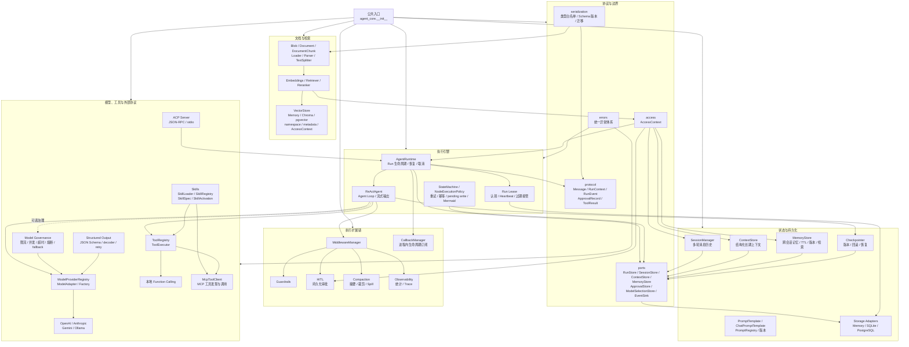
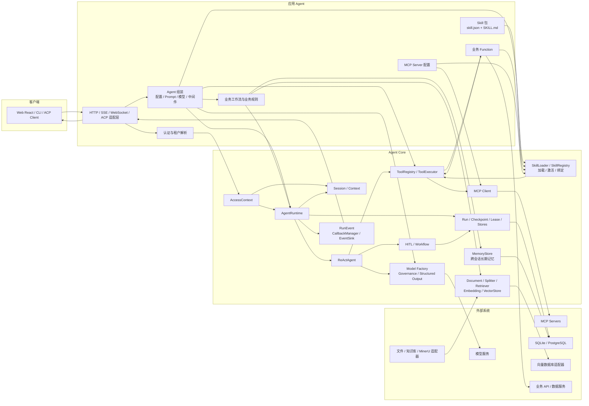
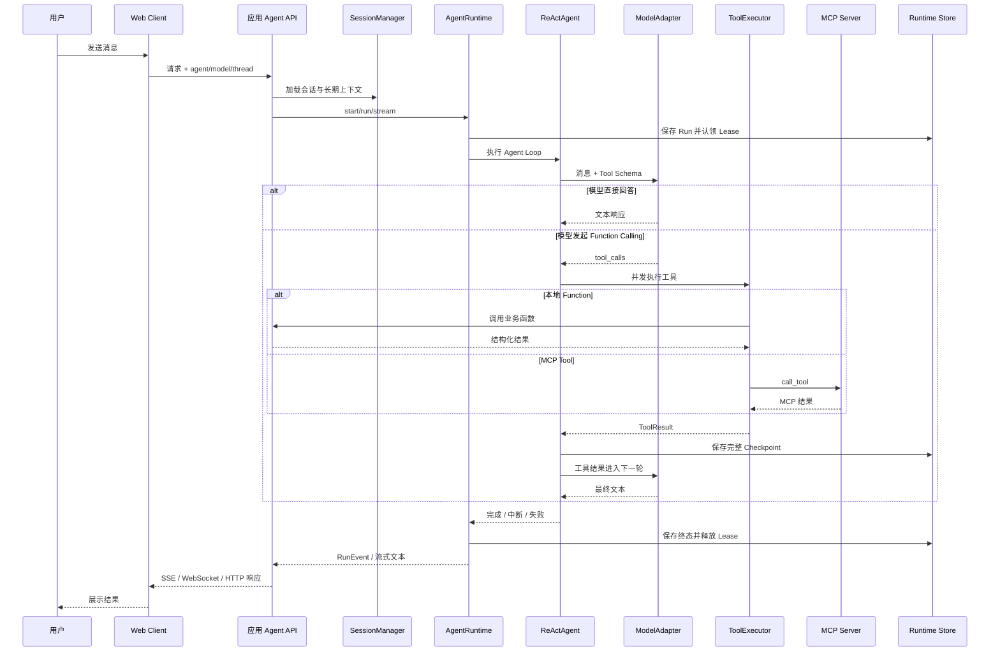
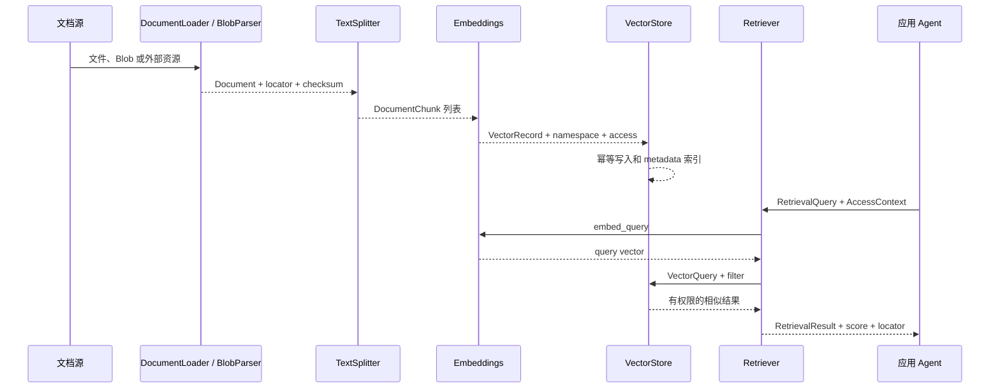
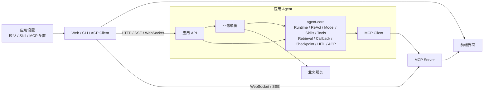

# Agent Core 架构

本文描述 `handwritten-agent-core` 自身的模块边界，以及应用 Agent 如何组装并调用 Core。
图中“应用层”由具体 Agent 项目实现；“Agent Core”零外部平台绑定，不依赖任何具体业务。

## 1. Agent Core 内部架构

模块责任遵循以下原则：

- `protocol` 只定义跨模块传递的数据结构；
- `ports` 定义依赖接口及接口使用的值对象，具体数据库实现放在 `storage`，禁止反向依赖；
- `runtime` 负责一次 Run 和 Agent Loop，不包含任何业务判断；
- `skills` 负责加载和激活 Skill，应用显式提供本地 Function 和 MCP 客户端绑定；
- `tools` 统一调度本地函数和 MCP 工具，模型只看到统一的 Tool Schema；
- `middleware` 承载可组合的横切能力，例如审批、压缩、安全和可观测性；
- `callbacks` 只观察生命周期事件，与 `EventSink` 共用 `RunEvent`，不能修改执行流程；
- `documents` 定义外部语料及来源定位，`retrieval` 定义检索端口及 Memory、Chroma、pgvector 适配器；
- `serialization` 只恢复白名单类型，不使用 pickle 或输入中的 Python 类路径；
- `workflow` 提供确定性状态机和节点级恢复，上层 Agent 定义具体业务节点；
- `model` 在 Provider 协议外提供可组合的结构化输出与调用治理，不把厂商能力写进 Agent Loop；
- `prompts` 提供安全模板、消息占位符和版本管理，拒绝属性或下标表达式；
- `MemoryStore` 保存跨会话记忆，外部知识语料使用独立的 `Retriever` 和 `VectorStore`；
- Memory 用于测试，SQLite 用于本地开发，PostgreSQL 用于生产多实例部署。

## 2. 应用 Agent 与 Agent Core 的调用关系

应用 Agent 提供具体 Skill 包、Function 实现、MCP 客户端及允许激活的 Skill 集合。Core 的
`SkillLoader` 负责安全加载和校验清单，`SkillRegistry` 负责注册与选择，激活结果把合并后的
instructions 和 Tool Schema 交给 `ReActAgent`。清单不会动态导入 Python 代码。

## 3. 一次 Function Calling / MCP 调用时序

## 4. 文档摄取与检索时序

Core 内置纯文本 Loader、递归字符切分器、内存 VectorStore、Chroma/pgvector 可选适配器和关键词
Retriever。MinerU、OCR、模型 Embedding SDK、Qdrant 和 FAISS 通过这些协议接入，不成为基础依赖。

## 5. 应用接入示例

应用 Agent 直接使用 Core 加载 Skill、注册工具、运行 Agent Loop；
业务层负责提示词、业务工具和业务数据，通过应用适配器把 Core 能力接入自己的协议。
两者读取同一套共享 Skill 清单和指令，但分别注入自己的 Function 与 MCP 客户端，
并分别运行应用 API 和 MCP Server，避免进程与端口冲突。

## 6. 架构图维护待办

- [ ] **持续任务，不关闭：** 每次修改 `agent-core/src/agent_core/**` 后，在同一提交中检查并更新本文。
- [ ] 模块、公共接口、调用方向、持久化对象、协议或应用接入关系变化时，更新对应 Mermaid 图。
- [ ] 即使图形关系没有变化，也要在下面的同步记录中说明已检查以及无需改图的原因。
- [x] 已实现 Core Skill 系统，并将应用层 Skill 包与 Core 加载、注册、激活职责分开。

### 同步记录

| 日期 | 代码基线 | 架构同步内容 |
| --- | --- | --- |
| 2026-09-26 | `08a5fa1` | 建立 Core 内部架构、应用调用关系、工具调用时序和应用接入拓扑。 |
| 2026-09-26 | 本次提交 | 新增 SkillLoader、SkillRegistry、SkillSpec 和 SkillActivation，并同步应用绑定关系。 |
| 2026-09-26 | 应用 Skill 接入 | 应用 Agent 共享 Skill 包，分别接入手写工具执行器和 LangChain StructuredTool。 |
| 2026-09-26 | Web MCP 动态配置 | Web 端可持久化、测试并重连内置或自定义 MCP 服务；同步浏览器与 Gateway 的连接关系。 |
| 2026-09-26 | Core 边界治理 | 模型选择值对象和唯一存储端口收口到 `ports`；`storage` 仅保留实现，并修复审批持久化与中间件导入环。 |
| 2026-09-27 | 文档站迁移 | VitePress 迁移至 Material for MkDocs；清理 node/pnpm 残留；同步记录补录。 |
| 2026-09-27 | Core 通用能力扩展 | 新增结构化输出、模型治理、长期记忆、Prompt 模板、节点执行策略、pending write 与 Mermaid 导出，并同步内部和应用调用关系。 |
| 2026-09-27 | Callback 与 Retrieval Core | 新增统一生命周期回调、文档加载和切分、检索协议、内存向量实现及安全序列化，并同步文档摄取和应用调用关系。 |
| 2026-09-27 | 严格类型检查修复 | 修正可选依赖边界、持久化数据收窄及动态 checkpoint 调用类型；模块关系和调用方向未变化，无需修改架构图。 |
| 2026-09-27 | 向量存储分层 | 新增 Chroma 开发适配器、pgvector 生产适配器和环境工厂，并同步检索与存储调用关系。 |
