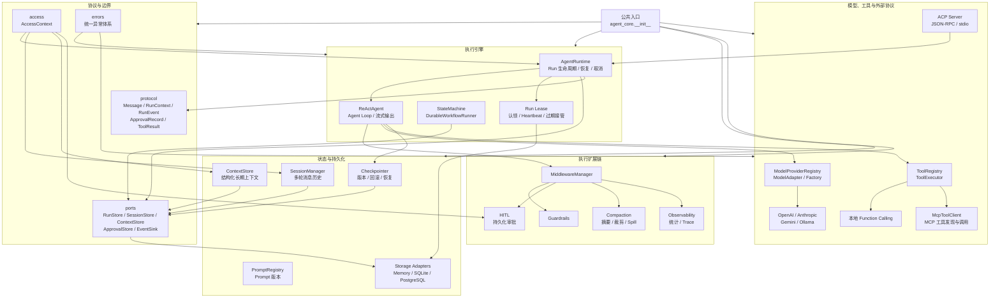
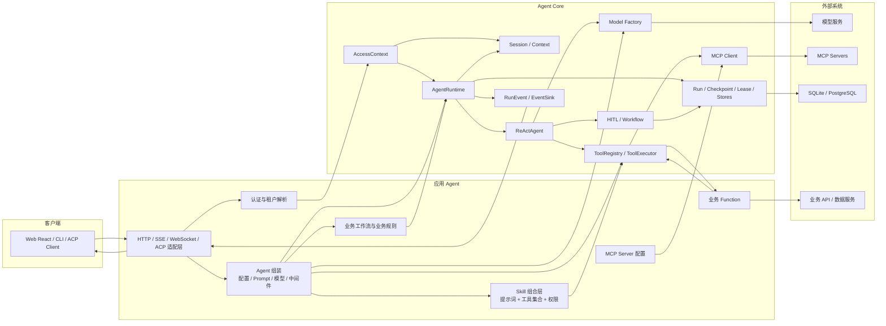
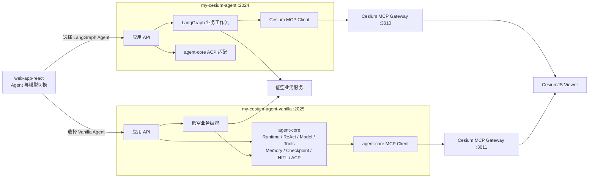

# Agent Core 架构

本文描述 `handwritten-agent-core` 自身的模块边界，以及应用 Agent 如何组装并调用 Core。
图中“应用层”由具体 Agent 项目实现；“Agent Core”不依赖 LangChain、LangGraph、FastAPI
或任何具体业务。

## 1. Agent Core 内部架构



模块责任遵循以下原则：

- `protocol` 只定义跨模块传递的数据结构；
- `ports` 只定义依赖接口，具体数据库实现放在 `storage`；
- `runtime` 负责一次 Run 和 Agent Loop，不包含 Cesium、航线等业务判断；
- `tools` 统一调度本地函数和 MCP 工具，模型只看到统一的 Tool Schema；
- `middleware` 承载可组合的横切能力，例如审批、压缩、安全和可观测性；
- `workflow` 提供确定性状态机和节点级恢复，上层 Agent 定义具体业务节点；
- Memory 用于测试，SQLite 用于本地开发，PostgreSQL 用于生产多实例部署。

## 2. 应用 Agent 与 Agent Core 的调用关系



这里的 `Skill 组合层` 目前属于应用 Agent：一个 Skill 可以组合提示词、本地 Function、MCP Tool、
权限和审批策略。Core 已经提供其底层组成能力，但尚未实现一等公民的 `SkillSpec`、
`SkillRegistry` 和动态加载器。

## 3. 一次 Function Calling / MCP 调用时序

```mermaid
sequenceDiagram
    actor User as 用户
    participant UI as Web/Client
    participant App as 应用 Agent API
    participant Session as SessionManager
    participant Runtime as AgentRuntime
    participant Loop as ReActAgent
    participant Model as ModelAdapter
    participant Tools as ToolExecutor
    participant MCP as MCP Server
    participant Store as Runtime/Checkpoint Store

    User->>UI: 发送消息
    UI->>App: 请求 + agent/model/thread
    App->>Session: 加载会话与长期上下文
    App->>Runtime: start/run/stream
    Runtime->>Store: 保存 Run 并认领 Lease
    Runtime->>Loop: 执行 Agent Loop
    Loop->>Model: 消息 + Tool Schema

    alt 模型直接回答
        Model-->>Loop: 文本响应
    else 模型发起 Function Calling
        Model-->>Loop: tool_calls
        Loop->>Tools: 并发执行工具
        alt 本地 Function
            Tools->>App: 调用业务函数
            App-->>Tools: 结构化结果
        else MCP Tool
            Tools->>MCP: call_tool
            MCP-->>Tools: MCP 结果
        end
        Tools-->>Loop: ToolResult
        Loop->>Store: 保存完整 Checkpoint
        Loop->>Model: 工具结果进入下一轮
        Model-->>Loop: 最终文本
    end

    Loop-->>Runtime: 完成 / 中断 / 失败
    Runtime->>Store: 保存终态并释放 Lease
    Runtime-->>App: RunEvent / 流式文本
    App-->>UI: SSE / WebSocket / HTTP 响应
    UI-->>User: 展示结果
```

## 4. 当前项目接入拓扑



当前 `my-cesium-agent-vanilla` 深度复用 Agent Core；`my-cesium-agent` 仍以 LangGraph
工作流为主，目前主要复用 Core 的 ACP 协议能力。两者共享前端交互契约，但分别运行自己的 Agent
API 和 Cesium MCP Gateway，避免进程与端口冲突。

## 5. 架构图维护待办

- [ ] **持续任务，不关闭：** 每次修改 `agent-core/src/agent_core/**` 后，在同一提交中检查并更新本文。
- [ ] 模块、公共接口、调用方向、持久化对象、协议或应用接入关系变化时，更新对应 Mermaid 图。
- [ ] 即使图形关系没有变化，也要在下面的同步记录中说明已检查以及无需改图的原因。
- [ ] 正式实现 Skill 系统后，把图中的应用层 Skill 组合升级为 Core 的 `SkillSpec`、
  `SkillRegistry`、加载器和执行策略。

### 同步记录

| 日期 | 代码基线 | 架构同步内容 |
| --- | --- | --- |
| 2026-09-26 | `08a5fa1` | 建立 Core 内部架构、应用调用关系、工具调用时序和双 Agent 接入拓扑。 |
