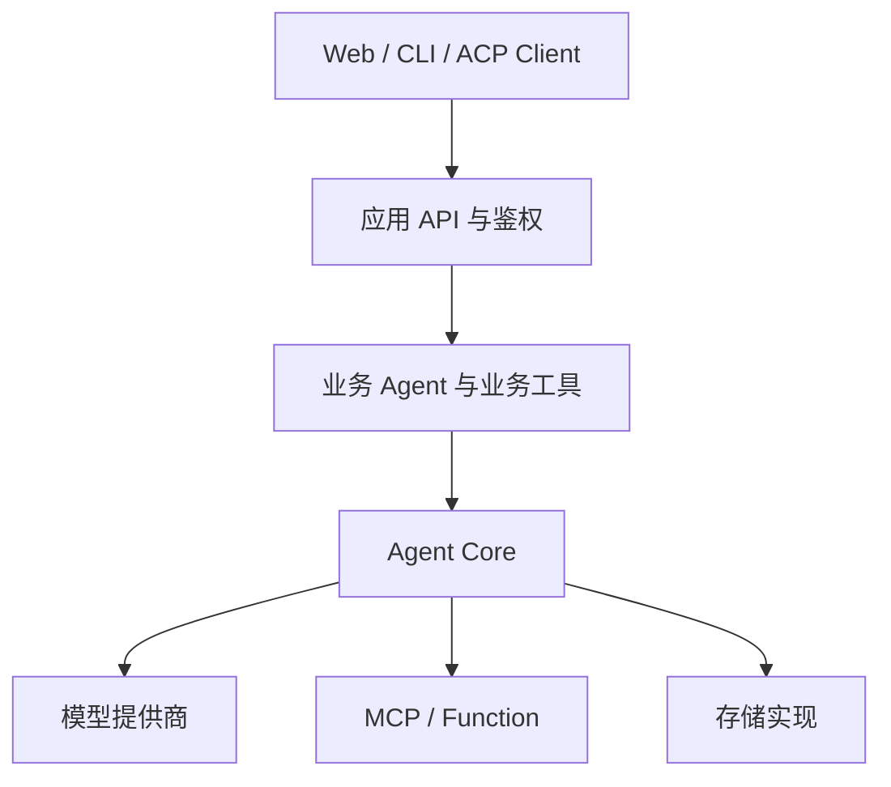

# 核心概念

Agent Core 把通用执行能力与业务应用分开。Core 不知道“无人机”“地图”或“订单”，
只处理消息、模型、工具、运行状态、恢复和协议。

## 分层关系

| 层 | 主要职责 |
| --- | --- |
| 应用层 | HTTP/WebSocket、用户认证、配置加载、业务 DTO、业务工具 |
| Agent Core | Agent Loop、运行生命周期、工具策略、工作流、协议和通用存储 |
| 基础设施 | 模型 API、MCP Server、SQLite、PostgreSQL、日志采集平台 |

## Message

`Message` 是模型交互的统一消息对象，支持 `system`、`user`、`assistant` 和 `tool` 角色，
并携带工具调用、工具调用 ID 与名称。具体 Provider 负责把它转换成厂商 SDK 格式。

## ModelAdapter

`ModelAdapter` 是 Agent Loop 依赖的最小协议：普通对话、流式对话和上下文用量。
应用可以使用内置 Provider，也可以注册自定义 Provider。Agent Loop 不直接依赖任何模型 SDK。

## Tool 与 Skill

`ToolRegistry` 保存可执行函数和策略元数据，`ToolExecutor` 负责校验、超时、审批和执行。
Skill 是一组指令和工具声明；激活 Skill 时，应用显式提供 Function 或 MCP 客户端绑定。

## ReActAgent 与 AgentRuntime

`ReActAgent` 实现“模型决定 -> 执行工具 -> 回填结果 -> 再调用模型”的循环。
`AgentRuntime` 在它外面管理 `RunContext`、事件、持久化、租约、恢复、取消和访问控制。

## Session、Context、Run 与 Checkpoint

这些对象解决的问题不同：

| 对象 | 保存内容 | 典型用途 |
| --- | --- | --- |
| Session | 会话消息历史和归属 | 多轮对话 |
| Context | 长期键值信息、版本和过期时间 | 用户偏好、业务背景、记忆 |
| RunContext | 一次执行的状态、事件、审批和恢复数据 | 运行跟踪、重启恢复 |
| Checkpoint | Agent Loop 某一时刻的完整消息和计数 | 回滚、时间旅行、循环恢复 |
| WorkflowExecution | 工作流节点状态和输入输出 | 跨进程工作流恢复 |

## Port 与实现

`agent_core.ports` 定义存储协议和值对象，`agent_core.storage` 提供内存、SQLite 和 PostgreSQL
实现。应用可以实现同一 Protocol，接入 Redis、云数据库或已有存储系统。

## AccessContext

`AccessContext` 携带 `user_id`、`tenant_id` 和角色。存储或 Runtime 启用
`require_access=True` 后，调用方必须传入身份，且只能访问同一用户与租户的数据；管理员角色
可按 Core 的访问规则跨用户访问。应用仍需先完成真实身份认证，Core 不签发 Token。
