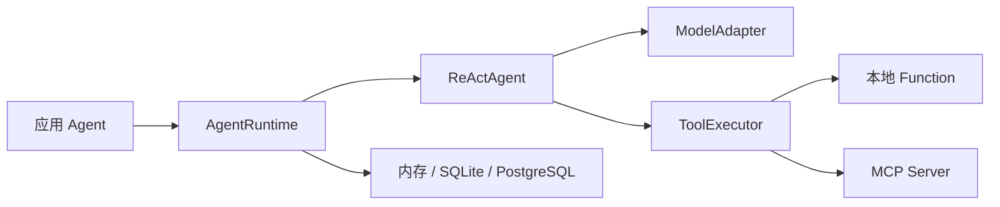

# Handwritten Agent Core

Handwritten Agent Core 是一个使用 Python 从头实现的 Agent 框架核心。它不依赖 LangChain、
LangGraph 或 Web 框架，应用可以按需接入模型、工具、MCP、持久化和自己的 API 层。

当前版本为 `0.1.0`，要求 Python 3.13，处于公开发布前的 Alpha 阶段。

<div class="doc-links" markdown>
  <a href="./guide/getting-started/">快速开始<br><small>安装并运行第一个 Agent</small></a>
  <a href="./guide/core-concepts/">核心概念<br><small>理解运行时、工具与存储边界</small></a>
  <a href="./ARCHITECTURE/">系统架构<br><small>Core 内部模块和应用调用关系</small></a>
  <a href="./CAPABILITIES/">能力清单<br><small>核对已经实现和不属于 Core 的功能</small></a>
</div>

## 适合什么场景

- 希望掌控 Agent Loop、状态、恢复和工具执行细节；
- 需要在多个业务 Agent 之间复用同一套基础设施；
- 需要同时支持 Function Calling、MCP 和声明式 Skill；
- 需要开发 SQLite、生产 PostgreSQL，以及用户和租户隔离；
- 需要在 Web API、CLI、Worker 或 ACP 客户端中复用同一个 Agent Runtime。

如果只需要快速拼装简单问答，成熟的第三方框架可能更省时间。这个项目更适合需要可读源码、
明确依赖方向和可替换端口的团队。

## 运行链路



## 安装方式

从源码开发：

```bash
git clone https://github.com/qiuzixu/agent-core.git
cd agent-core
python -m pip install -e ".[dev]"
python examples/basic_agent.py
```

发布到 PyPI 后，可按需安装：

```bash
pip install handwritten-agent-core
pip install "handwritten-agent-core[openai,mcp,production]"
```

模型、MCP 和 PostgreSQL SDK 都是可选依赖，未启用时不会影响基础包导入。

## 下一步

先阅读[快速开始](./guide/getting-started.md)，然后按需求选择模型、工具、存储和中间件。
准备部署前，请检查[存储与生产部署](./guide/storage-and-production.md)和项目根目录的
`SECURITY.md`。
